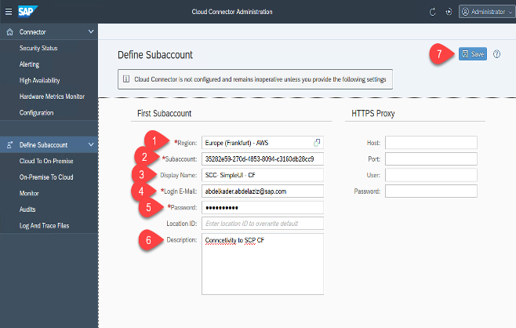
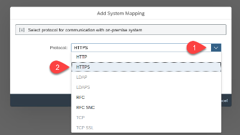
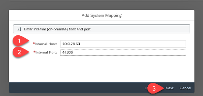
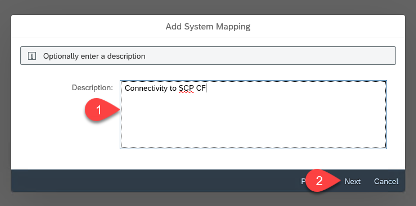
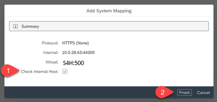
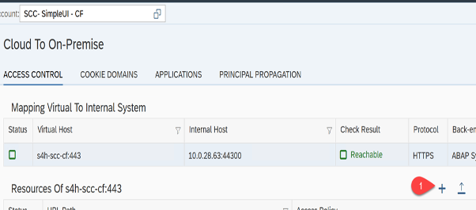
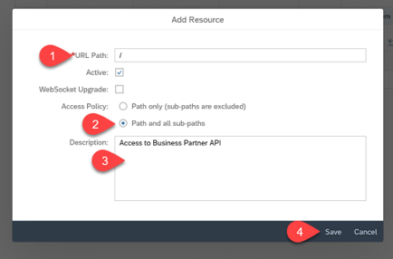
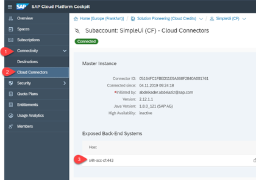
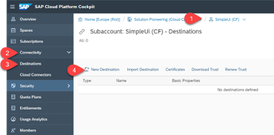
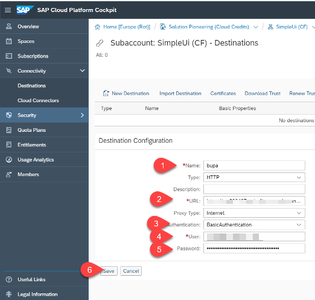

# Configure systems in Cloud Connector 

## Introduction

In this section you will configure the Cloud Connector for connecting the On Premise backend system to the SAP Cloud Platform. 

**Persona:** SCP Admin

### Configure Systems in Cloud Connector for access with technical user

1.	Open your Cloud Connector administration UI for the S/4HANA On Prem system.

    Go to https://localhost:8443/   
    
    Hint: adjust the port if you specified another one during the installation. Potentially you might have to use the external IP of your system. 

    Enter User Name and Password.
    Click Login.

    You can find detail information on installing the Cloud Connector in your system landscape here: 
    https://developers.sap.com/tutorials/cp-connectivity-install-cloud-connector.html

2.	Choose *Add Subaccount* and then fill out the needed input:
3.	Enter the following data:
    - Region
    - Subaccount
    - Display Name
    - Subaccount User
    - Password
    - Then click the *Save* button
    
    
    
    You can look the required data up in the SAP Cloud Platform Cockpit.
    
4.	Navigate to *Cloud to On-Premise* 
5.	To add a new system mapping click on the *'+'* on the right site of the screen

 
 
6.	In the pop-up window select 'ABAP System' as a *Backend Type* and then choose *Next*

 
 
7.	On the next screen select 'HTTPS' as a *Protocol* and then choose *Next*

8.	On the next screen enter your values for the fields: *Internal Host* and *Internal Port* then choose *Next*

9.	Choose *Principal Type* 'None' and press *Next*

10.	Select *Host in header* 'Use Virtual Host' and choose *Next*

11.	On the next screen add a *Description* for your system mapping

12.	Make sure all the values are correct in the summary and don´t forget to check the Internal Host checkmark.
13.	Choose *Finish*

14.	Click on Button *'+'* to Add resource

 
 
15.	Enter the following data:
    - URL Path
    - Check Path and All sub-paths
    - Description
    

### Create Cloud Foundry Destination

1.	Open your *SAP Cloud Platform Account* and navigate to your *Subaccount*
2.	Choose *Connectivity* in the menu on the left then choose *Cloud Connectors* to check the host details

3.	Go back to Connectivity in the menu on the left then choose *Destinations -> New Destination*

4.	Enter the following information to the Destination Configuration:
    - *Name:* bupa
    - *Url:* insert url of the on Prem system (e.g. http://s4ext:500/sap/opu/odata/sap/API_BUSINESS_PARTNER)
    - *Proxy Type*: OnPremise
    - Change *Proxy Type* to 'OnPremise'
    - Select *Authentication:* 'Basic Authentication'
    - Add location Id (In case of multiple CC)
    -Basic Authentication with User and PWD
5.	Click on *Save* (optionally you can also *check the connection*) and close the window

6.	Check Connection
